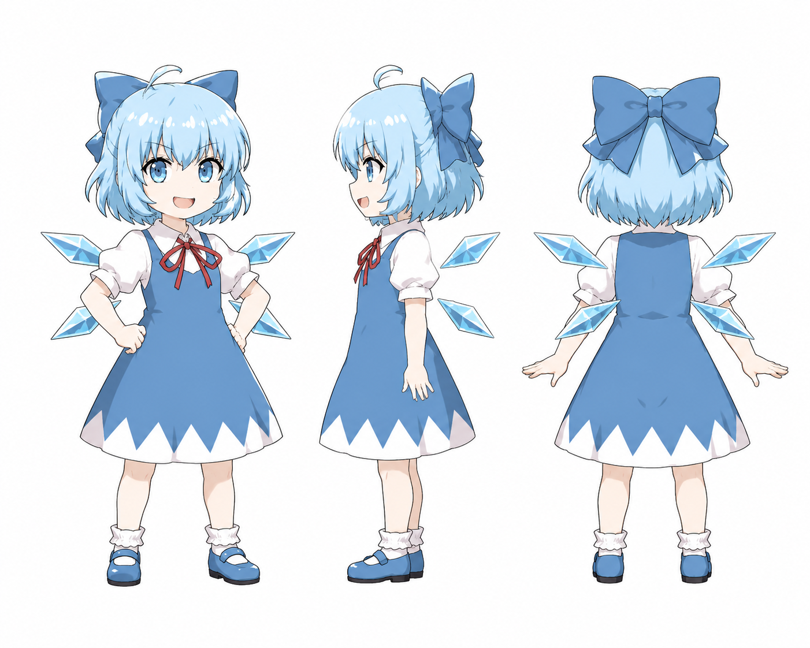
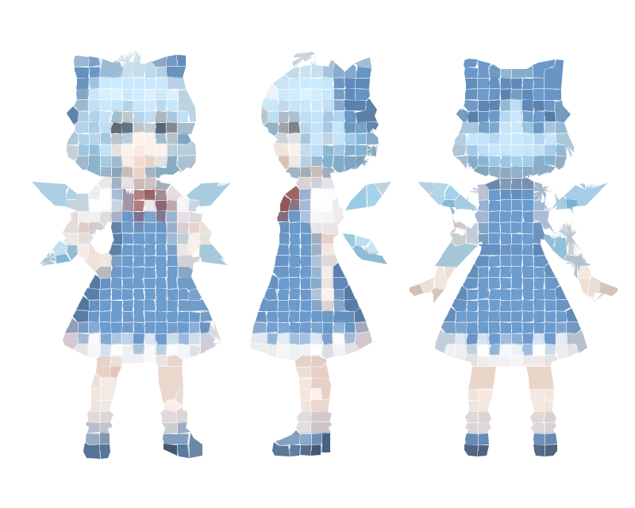

<div align="center">

# ❄️ Cirno SVG

**把照片冻成马赛克风格的 SVG 插画**

*琪露诺的完美冻结 — 纯前端、零后端、浏览器里完成一切*

</div>

---

## 它能做什么？

丢一张照片进去，琪露诺会：

1. **冻结背景** 🧊 — AI 语义分割，把主体从背景中剥离
2. **切割冰晶** ❄️ — SLIC 超像素算法，把主体分解成数百个颜色一致的色块
3. **雕刻轮廓** 🔍 — 检测色块之间的边界，生成矢量路径
4. **输出 SVG** ✨ — 双层矢量图：纯色填充层 + 细节描边层

最终效果是一种**马赛克风格**的矢量插画 — 像用无数细小的彩色瓷砖拼出你的照片：

<div align="center">

| 原图 (1.3 MB PNG) | → | 输出 (339 KB SVG) |
|:---:|:---:|:---:|
|  | ❄️ |  |

*789 块色填充 + 2798 条轮廓线 = 3587 个矢量路径*

</div>

---

## 马赛克风是什么？

不是模糊，不是像素化，而是**结构化的色块重组**：

```
传统位图          马赛克 SVG
┌──────────┐     ┌──────────┐
│ 连续渐变  │     │ ▪▪▪▪▪▪▪▪ │
│ 看不清边界 │ →  │ ▪▪▪▪▪▪▪▪ │
│ 放大就糊  │     │ ▪▪▪▪▪▪▪▪ │
└──────────┘     └──────────┘
                  每块一个颜色
                  块间有清晰边界
                  无限放大不模糊
```

**原理：** SLIC 超像素算法在空间距离和颜色距离之间寻找平衡 — 把「位置相近、颜色相似」的像素归为同一个区域。每个区域就是一块「瓷砖」，填充它的平均色。区域之间的边界就是 SVG 的轮廓线。

---

## 特性

| | |
|---|---|
| 🧊 **AI 去背景** | ONNX Runtime Web，浏览器端推理，首次下载后缓存 |
| ❄️ **超像素分割** | SLIC 算法，simplify 滑块控制色块大小 |
| 🎨 **双层 SVG** | `fills` 层（纯色块）+ `edges` 层（轮廓线），方便二次编辑 |
| ✏️ **绘制动画** | SVG 逐笔描绘动画，可回放、可调速 |
| 🌙 **深色/浅色** | 琪露诺冰蓝主题，一键切换 |
| 📱 **响应式** | 桌面 / 平板 / 手机自适应 |
| 🔒 **纯前端** | 零后端，图片不离开你的浏览器 |
| ⚡ **Web Worker** | 重计算在后台线程运行，处理时界面不卡顿 |
| 🩹 **智能边缘修复** | 自动填补背景移除产生的空洞和边缘碎片 |

---

## v1.1 更新日志

对比 v1.0，v1.1 在**性能、质量、稳定性**三个方面做了全面优化：

### 🐛 Bug 修复

| 问题 | 修复 |
|------|------|
| SLIC 迭代中 `dists` 数组未重置 | 每次迭代开始 `dists.fill(Infinity)`，分割质量显著提升 |
| 主体边缘灰色碎片 | 新增 `dilateEdges` 边缘膨胀处理，覆盖半透明残留 |
| 主体内部空洞 | 新增 `fillInteriorHoles` BFS 洪水填充，自动识别并填补误抠区域 |
| `loadImage` 内存泄漏 | Blob URL 在 `onload` 中正确 revoke |
| `innerHTML` 注入 SVG | 改用 `DOMParser` + `appendChild` 安全解析 |
| 轮廓排序导致自相交 | 改用 Moore 邻域追踪算法，非凸区域不再产生蝴蝶结 |

### ⚡ 性能优化

| 优化项 | v1.0 | v2.0 | 提升 |
|--------|------|------|------|
| 区域遍历 | O(Regions × Pixels) | O(Pixels) 单次遍历建索引 | **~79×** |
| 双边滤波 | 2D 卷积 O(R²×P) | 可分离 1D×2 O(R×P) | **~5-10×** |
| SLIC 迭代 | 3 次（dists 未重置） | 3 次（dists 正确重置） | 质量↑ |
| Douglas-Peucker | 递归 + 数组切片 | 迭代 + 原地标记 | GC 压力↓ |
| SVG 拼接 | 字符串 `+=` | 数组 `push` + `join` | 内存↓ |
| UI 响应 | 主线程阻塞 | Web Worker 后台处理 | **UI 不冻结** |

### 🔧 代码质量

- 删除死代码：`filterSubjectPaths`、`prepareForAnimation`
- 轮廓追踪：质心角度排序 → Moore 邻域追踪（8 方向）
- 错误提示：`alert()` → 页面内 UI 展示

---

## 快速开始

```bash
# 安装依赖
npm install

# 启动开发服务器
npm run dev

# 构建生产版本
npm run build
```

打开浏览器，拖入照片，等待冻结完成，下载 SVG。

---

## 技术栈

```
┌─────────────────────────────────────────────┐
│  Cirno SVG v1.1                             │
├──────────────┬──────────────────────────────┤
│  UI          │  Vanilla HTML/CSS/JS         │
│  主题        │  CSS Variables + data-theme   │
│  雪花粒子    │  CSS Animation                │
│  构建        │  Vite                         │
├──────────────┴──────────────────────────────┤
│  图像处理管线（Web Worker 后台运行）         │
├──────────────┬──────────────────────────────┤
│  去背景      │  @imgly/background-removal    │
│              │  ONNX Runtime Web (WebGL)     │
│  边缘修复    │  边缘膨胀 + 空洞 BFS 填充     │
│  预处理      │  可分离双边滤波               │
│  分割        │  SLIC 超像素聚类               │
│  轮廓提取    │  区域边界检测 + 游程编码        │
│  轮廓追踪    │  Moore 邻域追踪（8 方向）      │
│  路径简化    │  Douglas-Peucker（迭代版）     │
│  噪声清理    │  Alpha 清洗 + 孤立像素移除     │
│  背景残渣    │  连通域过滤                    │
└──────────────┴──────────────────────────────┘
```

---

## 项目结构

```
cirno-svg/
├── index.html                  # 主页面
├── package.json                # v2.0.0
├── vite.config.js
├── src/
│   ├── main.js                 # 入口：上传 → 冻结 → 动画
│   ├── style.css               # 琪露诺冰蓝主题 + 雪花动画
│   ├── lib/
│   │   ├── background-removal.js       # AI 背景移除封装
│   │   ├── svg-tracer.js               # Worker 薄包装
│   │   ├── svg-tracer-worker.js        # 核心算法（Web Worker）
│   │   └── svg-animator.js             # SVG 绘制动画
│   └── ui/
│       ├── theme.js            # 深色/浅色切换
│       ├── upload.js           # 拖拽上传
│       ├── processing.js       # 处理进度
│       └── result.js           # 结果展示
├── 微信图片_20260623150650_163_73.png   # 示例原图
└── illustration.svg                     # 示例输出
```

---

## 算法细节

### SLIC 超像素分割

SLIC（Simple Linear Iterative Clustering）将图像分成若干紧凑的区域：

```
每个像素被分配到最近的「种子点」
距离度量 = √( 空间距离² × m² + 颜色距离² )
                ↑                ↑
          相近的像素       相近的颜色
          归为一块          归为一块

m (compactness) 由 simplify 滑块控制：
  简洁 → m 大 → 大块少细节
  精细 → m 小 → 小块多细节
```

### 边缘修复管线

```
背景移除输出 → cleanupAlpha（二值化）
            → dilateEdges（膨胀 2px，覆盖灰色碎片）
            → fillInteriorHoles（BFS 标记真背景，填补内部空洞）
            → 干净的主体 mask → 送入 SLIC
```

### 双层 SVG 输出

```xml
<svg>
  <!-- 层 1：纯色填充 — 每个超像素区域一块颜色 -->
  <g id="fills">
    <path d="M...Z" fill="rgb(120,85,60)"/>
    <path d="M...Z" fill="rgb(95,72,55)"/>
    ...
  </g>

  <!-- 层 2：轮廓描边 — 区域之间的边界线 -->
  <g id="edges" stroke-linecap="round" stroke-linejoin="round">
    <path d="M...L..." fill="none" stroke="rgb(107,78,57)" stroke-width="0.8"/>
    ...
  </g>
</svg>
```

两层独立，可以在 Illustrator / Figma / Inkscape 中分别编辑：
- 隐藏 `edges` 层 → 干净的色块插画
- 隐藏 `fills` 层 → 纯轮廓线稿
- 两层叠加 → 完整的马赛克风插画

---

## 许可

MIT
